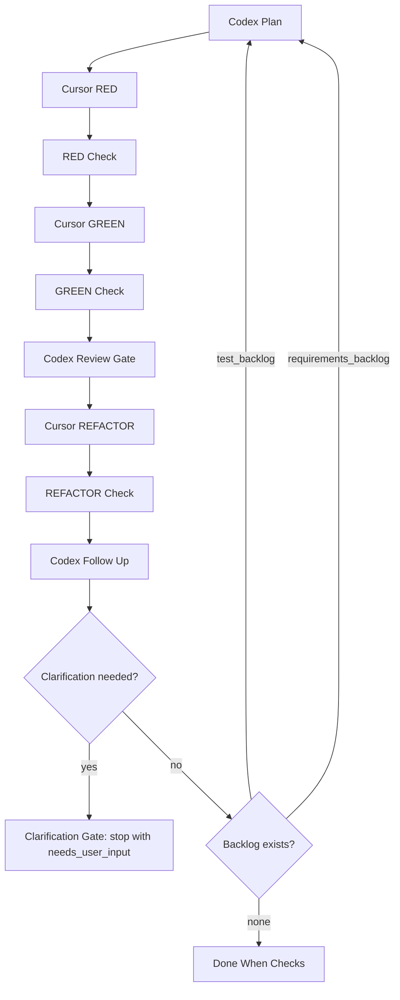

# AiTDD Architecture

AiTDD is a small orchestration layer for running a disciplined TDD loop with a
clear separation of responsibilities:

- Codex plans, reviews, follows up, and decides when human clarification is needed.
- Cursor implements RED, GREEN, and REFACTOR changes.
- Hook policy checks phase-level test expectations.
- Progress files preserve the story of each cycle and make resume/review possible.

## Process

## Gates

### Review Gate

The Review Gate runs after GREEN. It checks whether the current cycle obeyed the
TDD rules:

- `one_behavior_only`
- `minimal_green`
- `tests_unchanged_in_refactor`
- `acceptance_unit_boundary_ok`
- `forbidden_respected`

If the implementation is acceptable but more tests are needed, Codex returns
`missing_test_perspectives`. AiTDD stores them in `test_backlog` and uses them as
future RED candidates.

### Follow Up

Follow Up runs after REFACTOR. It is intentionally separate from Review Gate.
Review Gate asks "was this cycle disciplined?" while Follow Up asks "what did we
learn that should change the next cycle?"

Follow Up can produce:

- `missing_requirements`: inferred requirements that should become future behavior
- `additional_test_perspectives`: boundary, exception, or responsibility tests
- `questions_for_user`: decisions that AI should not guess

### Clarification Gate

Clarification Gate stops the loop when user judgment is needed. This protects the
system from inventing business rules or API semantics.

When `questions_for_user` is present, AiTDD:

- writes the questions to `.aitdd/progress.json`
- marks the root progress `status` as `needs_user_input`
- marks the current cycle as `needs_user_input`
- does not start another RED cycle

The intended follow-up flow is:

1. User answers the question.
2. The answer is added to the spec or backlog.
3. `aitdd resume --spec aitdd.yaml` continues from the paused cycle.

## Progress Model

AiTDD writes state under `.aitdd/`:

- `.aitdd/progress.json`
- `.aitdd/report.md`
- `.aitdd/cycles/<cycle>-<phase>.diff`

`progress.json` has four important root collections:

- `cycles`: phase results, review gate, follow up, and cycle status
- `test_backlog`: extra tests discovered by Review Gate or Follow Up
- `requirements_backlog`: missing requirements discovered by Follow Up
- `questions_for_user`: clarification questions that pause the loop

Cycle sources are explicit:

- `spec`: a behavior from `aitdd.yaml`
- `test_backlog`: a missing test perspective promoted to RED
- `requirements_backlog`: a missing requirement promoted to RED
- `codex`: the next behavior chosen by Codex when no spec/backlog exists

## Package Layout

- `src/aitdd/cli.py`: CLI commands (`plan`, `run`, `resume`)
- `src/aitdd/planning.py`: Codex-generated `aitdd.yaml` drafts
- `src/aitdd/runner.py`: RED-GREEN-REFACTOR orchestration
- `src/aitdd/review.py`: Review, Follow Up, and structured JSON schemas
- `src/aitdd/progress.py`: progress persistence, reports, diff snapshots, backlogs
- `src/aitdd/hook_policy.py`: phase policy checks
- `src/aitdd/agents.py`: official Codex SDK and Cursor SDK bridges

## Design Rules

- One cycle may add only one public behavior.
- RED must fail for the expected reason when `expected_red` is provided.
- GREEN must be the smallest change that passes the failing test.
- REFACTOR must not change test files.
- Missing test perspectives go to `test_backlog`, not ad hoc implementation.
- Missing requirements go to `requirements_backlog`, not guessed production code.
- Ambiguous decisions go to `questions_for_user` and stop the loop.
